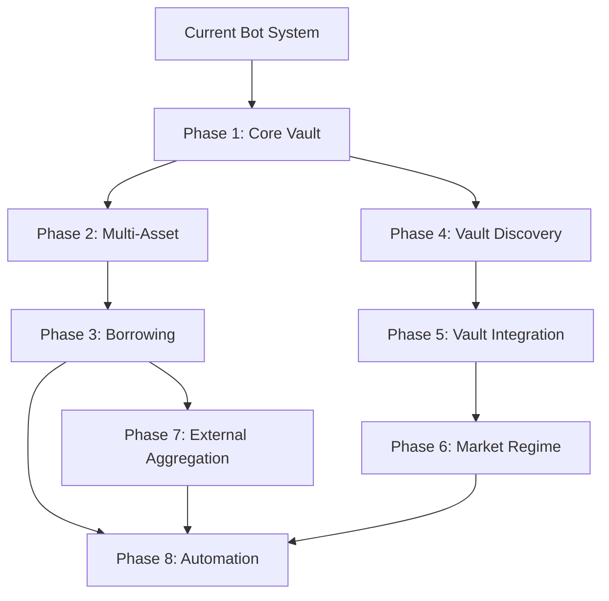

# QuantumVault Vaults Architecture

## Overview

Vaults represent an advanced capital management layer that utilizes Drift Protocol's Subaccount 0 for multi-asset collateral deposits, lending/borrowing capabilities, and yield optimization. This system will enable users to maximize capital efficiency while funding isolated trading bots.

**Plan Status**: 85% solid architecture. Critical constraints identified and mitigations documented below.

---

## CRITICAL TECHNICAL RISKS (Must Address Before Implementation)

These are "showstoppers" that could cause implementation failures if not handled correctly.

### 1. Collateral Eligibility Reality vs Plan

**The Assumption**: Users can deposit any asset (JLP, Strategy Vault Tokens) and borrow against them.

**The Reality**: Drift Protocol has a **strict whitelist** for collateral.

| Asset | Collateral Status | Initial Weight | Can Borrow Against? |
|-------|------------------|----------------|---------------------|
| USDC | ✅ Confirmed | 100% | Yes |
| SOL | ✅ Confirmed | 80% | Yes |
| BTC | ✅ Confirmed | 85% | Yes |
| ETH | ✅ Confirmed | 85% | Yes |
| USDT | ✅ Confirmed | 100% | Yes |
| INF (Infinity) | ✅ Confirmed | 71% | Yes |
| JLP (Jupiter LP) | ❌ NOT COLLATERAL | 0% | **NO** |
| Strategy Vault Tokens | ❌ NOT COLLATERAL | 0% | **NO** |

**Impact**: Users can deposit JLP to earn yield, but they **CANNOT borrow USDC against it** to fund bots. This breaks the "Capital Efficiency" loop for those specific assets.

**Mitigation**:
```typescript
// Split assets in database
type AssetCategory = 'collateral' | 'yield_only';

interface AssetConfig {
  symbol: string;
  category: AssetCategory;
  canBorrowAgainst: boolean;
  initialWeight: number;  // 0 for yield-only assets
}

const ASSET_CONFIGS: AssetConfig[] = [
  { symbol: 'USDC', category: 'collateral', canBorrowAgainst: true, initialWeight: 1.0 },
  { symbol: 'SOL', category: 'collateral', canBorrowAgainst: true, initialWeight: 0.8 },
  { symbol: 'INF', category: 'collateral', canBorrowAgainst: true, initialWeight: 0.71 },
  { symbol: 'JLP', category: 'yield_only', canBorrowAgainst: false, initialWeight: 0 },
];
```

**UI Update**: Show clear distinction between "Collateral Assets" and "Yield-Only Assets" with tooltips explaining the difference.

### 2. Subaccount Transfer Friction (The 3-TX Problem)

**The Assumption**: Subaccount 0 can directly fund bot subaccounts.

**The Reality**: In Drift v2, all subaccounts are **peers**, not hierarchical. To fund a bot:

```
Step 1: Borrow USDC on Subaccount 0 (TX #1)
Step 2: Withdraw from Subaccount 0 to Agent Wallet (TX #2)  
Step 3: Deposit from Agent Wallet to Bot Subaccount (TX #3)

Total Time: 5-15 seconds
Total Fees: 3x transaction costs
```

**Critical Race Condition**: If a bot is nearing liquidation and needs emergency funding, this 15-second delay could be fatal during high network congestion.

**Mitigation - Smart Buffer Strategy**:
```typescript
interface BotBufferConfig {
  // Instead of $0 idle cash, maintain a safety buffer
  minBufferPercent: number;    // Default: 10% of max position size
  
  // Pre-fund bots proactively, not reactively
  proactiveFundingThreshold: number;  // Trigger top-up at 20% buffer remaining
}

// Example: Bot with $1000 max position
// Keep $100 buffer at all times
// Start top-up process when buffer drops to $20
// This gives 15+ seconds of runway before critical
```

**Alternative**: Keep USDC directly in agent wallet (current system) for time-critical operations. Only use vault borrowing for scheduled/planned funding.

### 3. Lulo API Availability Risk

**The Assumption**: Phase 7 can use "Lulo API as shortcut" (1-2 days).

**The Reality**: Lulo (FlexLend) does **NOT currently publicize a robust open developer API** for third-party integrators to route funds programmatically.

**Impact**: Phase 7 may require building individual adapters for Kamino, Marginfi, Solend, etc. - making it 5-7 days minimum, not 1-2 days.

**Mitigation Options**:
1. **Contact Lulo directly** - Request API access for integration partnership
2. **Build single adapter first** - Start with just Kamino to prove concept
3. **Defer Phase 7** - Focus on Drift-native strategies until external demand is validated

---

## ARCHITECTURAL GAPS & REFINEMENTS

### Gap 1: The Deleverage Spiral (Force Recall Protocol)

**Scenario**: Vault health drops critically. Need to repay USDC debt. But the USDC is locked inside active bot positions.

**Missing Protocol**:
```typescript
interface ForceRecallProtocol {
  // 1. Vault detects low health
  onHealthCritical(vaultId: string): void {
    const allocatedToBots = this.getBotAllocations(vaultId);
    const recallNeeded = this.calculateRecallAmount(vaultId);
    
    // 2. Send recall signal to bots (prioritize by drawdown)
    const botsByDrawdown = allocatedToBots.sort((a, b) => a.currentPnl - b.currentPnl);
    
    for (const bot of botsByDrawdown) {
      if (recallNeeded <= 0) break;
      
      // 3. Force close positions at market
      await this.forceClosePosition(bot.id);
      
      // 4. Transfer freed USDC back to vault
      const freed = await this.recallFunds(bot.id, bot.freeCollateral);
      recallNeeded -= freed;
    }
    
    // 5. Repay debt
    await this.repayDebt(vaultId);
  }
}
```

**User Preference Required**:
```typescript
type DeleveragePreference = 
  | 'save_vault'      // Close positions immediately, lock in losses if needed
  | 'risk_liquidation' // Keep positions open, hope for rebound
  | 'partial_close';   // Close 50% of positions as compromise

// Add to user settings
deleveragePreference: DeleveragePreference;
```

### Gap 2: Oracle Latency vs Liquidation Speed

**The Problem**: Plan calls for "Risk Management Agent runs every minute."

**The Reality**: Drift's liquidators are **bots running in milliseconds**. If SOL crashes 5% in 1 minute, Drift will liquidate the user BEFORE your agent wakes up.

**Mitigation**:
```typescript
// DON'T: Poll every minute
setInterval(() => checkHealth(), 60000); // Too slow!

// DO: Subscribe to WebSocket account updates
const connection = new Connection(RPC_URL);
connection.onAccountChange(
  userAccountPubkey,
  (accountInfo) => {
    const health = parseHealthFromAccount(accountInfo);
    if (health < WARNING_THRESHOLD) {
      triggerImmediateRiskCheck();
    }
  },
  'confirmed'
);
```

**Threshold Adjustments**:
| Threshold | Current Plan | Recommended | Reason |
|-----------|-------------|-------------|--------|
| Warning | 1.5 | 1.5 | Good |
| Critical | 1.2 | **1.3** | More runway before liquidation |
| Emergency | 1.1 | **1.15** | Drift liquidates at ~1.0, need buffer |

### Gap 3: Interest Rate Volatility (Negative Carry)

**The Problem**: Drift borrow rates are variable and can spike to >100% APR during high utilization.

**Scenario**:
- User borrows USDC at 5% APR to fund a bot
- Bot generates 20% returns - great!
- Market stress hits, utilization spikes to 90%
- Borrow APR jumps to 60%
- User is now **losing 40%** net

**Mitigation - Negative Carry Protection Agent**:
```typescript
interface NegativeCarryProtector {
  checkInterval: 3600000; // Every hour
  
  async check(userId: string): Promise<void> {
    const borrowApy = await this.getCurrentBorrowApy();
    const botAvgReturn = await this.getAverageBotReturn(userId, 7); // 7-day avg
    
    if (borrowApy > botAvgReturn) {
      const hoursInNegative = await this.getHoursInNegativeCarry(userId);
      
      if (hoursInNegative > 6) {
        // Alert user
        await this.notify(userId, 'negative_carry', {
          borrowApy,
          botReturn: botAvgReturn,
          recommendation: 'Consider reducing borrowed position'
        });
        
        // Optional: Auto-unwind if configured
        if (user.autoUnwindOnNegativeCarry) {
          await this.initiateGradualUnwind(userId);
        }
      }
    }
  }
}
```

---

## PHASE 0: PREREQUISITES (Before Any Implementation)

Based on reviewer feedback, add this phase before starting:

### Security Prerequisites
- [ ] Smart contract interaction audit (review Drift SDK usage patterns)
- [ ] Agent wallet security review (multi-sig or hardware wallet for high TVL)
- [ ] Oracle sanity checks implemented (max 10% deviation from averages)
- [ ] Emergency withdrawal procedures documented and tested

### Technical Prerequisites
- [ ] Dedicated RPC endpoint with high rate limits (not public)
- [ ] WebSocket subscription infrastructure for real-time account updates
- [ ] Redis caching layer for yield data (5-minute TTL)
- [ ] Monitoring and alerting infrastructure (PagerDuty/Discord)

### Testing Prerequisites
- [ ] Historical data backtesting for agents (simulate 2022 bear market)
- [ ] Chaos engineering tests (simulate oracle failures, RPC outages)
- [ ] Load testing for RPC calls at scale (50k calls/day target)
- [ ] Canary deployment pipeline (roll features to 10% of users first)

### Legal/Compliance Prerequisites
- [ ] Legal review of lending/borrowing features in target jurisdictions
- [ ] Risk disclosure documentation for users
- [ ] Terms of service updates for vault features

### User Validation Prerequisites
- [ ] Survey existing bot users on vault interest
- [ ] Identify 5-10 beta testers for Phase 1
- [ ] Document specific pain points to solve

---

## LEVERAGING EXISTING SYSTEMS

Build on existing infrastructure rather than reinventing the wheel. The vault system can reuse many functions already in production.

### Existing Functions to Reuse

| Function | Location | Vault Use Case |
|----------|----------|----------------|
| `executeAgentDriftDeposit` | drift-service.ts | Deposit to vault subaccount |
| `executeAgentDriftWithdraw` | drift-service.ts | Withdraw from vault |
| `executeAgentTransferBetweenSubaccounts` | drift-service.ts | Move funds vault → bot |
| `getDriftAccountInfo` | drift-service.ts | Get vault health metrics |
| `settlePnl` | drift-service.ts | Settle PnL before withdrawals |
| `getAgentUsdcBalance` | agent-wallet.ts | Check agent wallet balance |
| `getPrimaryRpcUrl` / `getBackupRpcUrl` | rpc-config.ts | RPC fallback logic |

### New Functions Needed (Build on Existing Patterns)

```typescript
// These follow existing patterns in drift-service.ts

// 1. Borrow USDC from vault (extends executeAgentDriftDeposit pattern)
export async function executeVaultBorrow(
  agentPublicKey: string,
  encryptedPrivateKey: string,
  amountUsdc: number,
  subAccountId: number = 0
): Promise<{ success: boolean; signature?: string; error?: string }>;

// 2. Repay borrowed USDC (extends executeAgentDriftWithdraw pattern)  
export async function executeVaultRepay(
  agentPublicKey: string,
  encryptedPrivateKey: string,
  amountUsdc: number,
  subAccountId: number = 0
): Promise<{ success: boolean; signature?: string; error?: string }>;

// 3. Get vault health (extends getDriftAccountInfo pattern)
export async function getVaultHealth(
  agentPublicKey: string,
  subAccountId: number = 0
): Promise<{
  totalCollateral: number;
  effectiveCollateral: number;  // With weights applied
  totalBorrows: number;
  healthFactor: number;
  liquidationPrice: number | null;
}>;
```

---

## RPC OPTIMIZATION FOR VAULTS

Vaults are NOT time-critical like bot trades. This allows for smarter RPC usage.

### Key Insight: Vaults Have More Time

| Operation | Bot Trades | Vaults |
|-----------|-----------|--------|
| Time sensitivity | Milliseconds matter | Seconds/minutes OK |
| Failure impact | Missed trade, potential loss | Retry acceptable |
| RPC priority | Highest | Can yield to trades |
| Fallback viable | Rarely used (Triton) | Good use case |

### Current RPC Infrastructure

```typescript
// server/rpc-config.ts - Already exists
export function getPrimaryRpcUrl(): string;    // Helius (fast, reliable)
export function getBackupRpcUrl(): string;     // Triton (fallback)
export function getAllRpcUrls(): string[];     // Both
```

### Smart RPC Selection for Vaults

Since vault operations aren't time-critical, implement intelligent RPC selection:

```typescript
interface VaultRpcConfig {
  // Existing infrastructure
  primaryRpc: string;      // Helius - use for health checks, critical ops
  backupRpc: string;       // Triton - use for non-critical, batch ops
  
  // New: Load-based selection
  useBackupWhenPrimaryBusy: boolean;  // Default: true
  primaryBusyThreshold: number;       // Requests/sec before switching (e.g., 20)
  
  // New: Latency-based selection
  checkLatencyBeforeCall: boolean;    // Default: true for vault ops
  maxAcceptableLatency: number;       // ms - use backup if primary exceeds
}

// Smart RPC selector for vault operations
async function getVaultRpc(): Promise<string> {
  const primary = getPrimaryRpcUrl();
  const backup = getBackupRpcUrl();
  
  // If no backup, use primary
  if (!backup) return primary;
  
  // Check current system load (reuse existing rate limit tracking)
  const currentLoad = getRpcRequestCount(); // From routes.ts rate limiting
  if (currentLoad > 20) {
    console.log('[Vault RPC] Primary busy, using backup');
    return backup;
  }
  
  // Optional: Quick latency check (only for non-urgent vault ops)
  if (shouldCheckLatency()) {
    const primaryLatency = await measureLatency(primary);
    const backupLatency = await measureLatency(backup);
    
    if (primaryLatency > 500 && backupLatency < primaryLatency) {
      console.log(`[Vault RPC] Primary slow (${primaryLatency}ms), using backup (${backupLatency}ms)`);
      return backup;
    }
  }
  
  return primary;
}

// Latency measurement (lightweight, cached)
const latencyCache = new Map<string, { latency: number; timestamp: number }>();
const LATENCY_CACHE_TTL = 60000; // 1 minute

async function measureLatency(rpcUrl: string): Promise<number> {
  const cached = latencyCache.get(rpcUrl);
  if (cached && Date.now() - cached.timestamp < LATENCY_CACHE_TTL) {
    return cached.latency;
  }
  
  const start = Date.now();
  try {
    const connection = new Connection(rpcUrl);
    await connection.getSlot(); // Lightweight call
    const latency = Date.now() - start;
    latencyCache.set(rpcUrl, { latency, timestamp: Date.now() });
    return latency;
  } catch {
    return 9999; // Mark as unavailable
  }
}
```

### RPC Call Frequency Limits for Vaults

Vault operations should NOT spam the RPC. Enforce reasonable frequencies:

```typescript
interface VaultOperationLimits {
  // Health checks
  healthCheckInterval: 60000;       // Every 60 seconds (not every minute per user)
  healthCheckBatchSize: 10;         // Check 10 users per batch
  
  // Yield rate fetching
  yieldRateRefresh: 300000;         // Every 5 minutes
  yieldRateCache: true;             // Cache for all users
  
  // Capital rotation decisions
  rotationEvalInterval: 21600000;   // Every 6 hours
  rotationMinThreshold: 0.02;       // 2% APY difference minimum
  
  // Rebalancing
  rebalanceCheckInterval: 604800000; // Weekly
  rebalanceMinDelta: 0.10;          // 10% allocation difference
}

// Global vault scheduler (not per-user)
class VaultScheduler {
  private healthCheckQueue: string[] = [];
  
  async runHealthChecks(): Promise<void> {
    // Batch all users needing health checks
    const usersToCheck = await this.getUsersWithActiveVaults();
    
    // Process in batches of 10
    for (let i = 0; i < usersToCheck.length; i += 10) {
      const batch = usersToCheck.slice(i, i + 10);
      
      // Use backup RPC for batch operations
      const rpc = await getVaultRpc();
      
      // Batch account fetch (1 RPC call for multiple accounts)
      const accounts = await getBatchDriftAccountInfo(
        rpc,
        batch.map(u => u.agentPublicKey)
      );
      
      // Process results
      for (const account of accounts) {
        if (account.healthFactor < WARNING_THRESHOLD) {
          await this.triggerHealthAlert(account);
        }
      }
      
      // Rate limit between batches
      await sleep(1000);
    }
  }
}
```

### Existing Batch Functions to Leverage

Already have batch RPC optimization in place:

```typescript
// drift-service.ts - Already exists
getBatchDriftAccountInfo()   // Single RPC call for multiple accounts
getBatchPerpPositions()      // Single RPC call for multiple positions
```

Use these for vault operations instead of individual calls.

### RPC Cost Estimates

| Operation | Calls/Day (100 users) | With Batching | Savings |
|-----------|----------------------|---------------|---------|
| Health checks (per user) | 1,440 | 144 | 90% |
| Yield rate checks | 28,800 | 288 | 99% |
| Balance checks | 2,400 | 240 | 90% |
| **Total** | **32,640** | **672** | **98%** |

### Triton Fallback Strategy

Triton has been underutilized. For vaults, it's a good fit:

```typescript
// Vault operation categories
const VAULT_OP_RPC_PRIORITY = {
  // Use PRIMARY (Helius) - time matters
  'emergency_deleverage': 'primary',
  'liquidation_check': 'primary',
  'force_recall': 'primary',
  
  // Use EITHER (load-based) - can tolerate delay
  'health_check': 'smart',
  'balance_refresh': 'smart',
  
  // Use BACKUP (Triton) - background, non-urgent
  'yield_rate_fetch': 'backup',
  'historical_data': 'backup',
  'vault_discovery': 'backup',
  'apy_comparison': 'backup',
};

async function executeVaultOperation(
  operation: string,
  fn: (rpc: string) => Promise<any>
): Promise<any> {
  const priority = VAULT_OP_RPC_PRIORITY[operation] || 'smart';
  
  let rpc: string;
  switch (priority) {
    case 'primary':
      rpc = getPrimaryRpcUrl();
      break;
    case 'backup':
      rpc = getBackupRpcUrl() || getPrimaryRpcUrl();
      break;
    case 'smart':
    default:
      rpc = await getVaultRpc();
  }
  
  return fn(rpc);
}
```

---

## MAINTAINABILITY GUIDELINES

Technical complexity is acceptable IF maintainable. Follow these principles:

### 1. Code Organization

```
server/
├── drift-service.ts        # Existing - core Drift operations
├── vault-service.ts        # NEW - vault-specific logic
├── vault-health.ts         # NEW - health monitoring
├── vault-agents/           # NEW - intelligent automation
│   ├── yield-arbitrage.ts
│   ├── risk-management.ts
│   ├── profit-distribution.ts
│   └── scheduler.ts        # Coordinates all agents
└── rpc-config.ts           # Existing - extend for smart selection
```

### 2. Single Responsibility

Each vault agent should do ONE thing well:

```typescript
// GOOD: Single responsibility
class YieldArbitrageAgent {
  async evaluate(): Promise<YieldDecision>;
  async execute(decision: YieldDecision): Promise<void>;
}

// BAD: God class doing everything
class VaultManager {
  async checkYield(): Promise<void>;
  async checkHealth(): Promise<void>;
  async rebalance(): Promise<void>;
  async distribute(): Promise<void>;
  // ... 50 more methods
}
```

### 3. Configuration Over Code

Make thresholds configurable, not hardcoded:

```typescript
// GOOD: Configurable
const config = {
  healthWarningThreshold: parseFloat(process.env.VAULT_HEALTH_WARNING || '1.5'),
  yieldDifferenceThreshold: parseFloat(process.env.VAULT_YIELD_DIFF || '0.02'),
  rebalanceInterval: parseInt(process.env.VAULT_REBALANCE_INTERVAL || '604800000'),
};

// BAD: Magic numbers everywhere
if (health < 1.5) { ... }
if (apyDiff > 0.02) { ... }
```

### 4. Graceful Degradation

Every vault operation should have fallbacks:

```typescript
async function getVaultYield(vaultId: string): Promise<number> {
  try {
    // Try API first
    return await fetchFromDriftApi(vaultId);
  } catch (apiError) {
    console.warn('API failed, falling back to on-chain');
    try {
      // Fallback to on-chain
      return await calculateFromOnChain(vaultId);
    } catch (chainError) {
      console.warn('On-chain failed, using cached');
      // Final fallback: cached value
      return getCachedYield(vaultId) || 0;
    }
  }
}
```

### 5. Logging & Observability

Vault operations should be traceable:

```typescript
// Structured logging for vault operations
function logVaultOp(operation: string, details: object): void {
  console.log(JSON.stringify({
    timestamp: new Date().toISOString(),
    service: 'vault',
    operation,
    ...details,
  }));
}

// Usage
logVaultOp('health_check', { 
  userId: 'xxx', 
  healthFactor: 1.45, 
  rpcUsed: 'backup',
  latencyMs: 120 
});
```

### 6. Testing Strategy

```typescript
// Unit tests: Agent logic in isolation
describe('YieldArbitrageAgent', () => {
  it('should recommend swap when APY diff > threshold');
  it('should NOT swap when break-even > 7 days');
  it('should handle API failures gracefully');
});

// Integration tests: With mock RPC
describe('VaultHealthCheck', () => {
  it('should batch multiple user checks');
  it('should fallback to backup RPC on timeout');
});

// Simulation tests: Historical data
describe('VaultAgentBacktest', () => {
  it('should survive 2022 bear market without liquidation');
  it('should outperform passive USDC lending');
});
```

---

## ADDITIONAL DATABASE SCHEMA

Based on reviewer feedback, add these tables/fields:

### Vault Health Tracking
```typescript
// Add to vaults table
effectiveCollateralValue: real("effective_collateral_value"),  // With weights applied
maintenanceCollateralValue: real("maintenance_collateral_value"), // For liquidation checks
liquidationPrice: real("liquidation_price"),  // Approx SOL price where health < 1
lastHealthCheck: timestamp("last_health_check"),
```

### Transfer Logs (Multi-Step Transaction Tracking)
```typescript
// New table: track the 3-step transfer flow
export const transferLogs = pgTable("transfer_logs", {
  id: varchar("id").primaryKey().default(sql`gen_random_uuid()`),
  walletAddress: varchar("wallet_address").notNull(),
  fromSubaccount: integer("from_subaccount").notNull(),
  toSubaccount: integer("to_subaccount").notNull(),
  amount: real("amount").notNull(),
  
  // Track each step
  step1Status: varchar("step1_status"),  // 'pending' | 'success' | 'failed'
  step1TxSignature: varchar("step1_tx_signature"),
  step1CompletedAt: timestamp("step1_completed_at"),
  
  step2Status: varchar("step2_status"),
  step2TxSignature: varchar("step2_tx_signature"),
  step2CompletedAt: timestamp("step2_completed_at"),
  
  step3Status: varchar("step3_status"),
  step3TxSignature: varchar("step3_tx_signature"),
  step3CompletedAt: timestamp("step3_completed_at"),
  
  overallStatus: varchar("overall_status"),  // 'in_progress' | 'completed' | 'failed' | 'rolled_back'
  errorMessage: text("error_message"),
  
  createdAt: timestamp("created_at").defaultNow(),
  updatedAt: timestamp("updated_at").defaultNow(),
});
```

### Negative Carry Tracking
```typescript
// Track borrow APY vs returns for negative carry detection
export const carryTracking = pgTable("carry_tracking", {
  id: varchar("id").primaryKey().default(sql`gen_random_uuid()`),
  walletAddress: varchar("wallet_address").notNull(),
  borrowApy: real("borrow_apy").notNull(),
  botAverageReturn: real("bot_average_return").notNull(),
  isNegativeCarry: boolean("is_negative_carry").notNull(),
  consecutiveNegativeHours: integer("consecutive_negative_hours").default(0),
  recordedAt: timestamp("recorded_at").defaultNow(),
});
```

---

## REVISED IMPLEMENTATION RECOMMENDATIONS

Based on critical risks identified:

### Phase Priority Adjustments

```
ORIGINAL ORDER:
1 → 2 → 3 → 4 → 5 → 6 → 7 → 8

REVISED ORDER (Risk-Adjusted):
1 → 2 → 4 → 3 → 5 → 6 → 8 → 7

Changes:
- Phase 4 (Vault Discovery) moved BEFORE Phase 3 (Borrowing)
  Reason: Confirm which vaults provide valid collateral before building borrow logic
  
- Phase 7 (External Aggregation) moved to LAST
  Reason: Highest risk, Lulo API uncertain, build Drift-native first
```

### Phase 3 (Borrowing) - Risk Mitigations

1. **Start with manual triggers only** - No auto-borrow until transfer speed is proven
2. **Implement Smart Buffer** - Keep 10% idle in bot accounts
3. **Add Negative Carry Protection** - Monitor borrow APY vs returns
4. **Use WebSockets** - Not polling for health checks

### Phase 4 (Vault Discovery) - Focus Areas

1. **Prioritize INF vault** - Confirmed 71% collateral weight
2. **Skip JLP initially** - Not valid collateral, pure yield only
3. **Document collateral vs yield-only** - Clear UI distinction

### Phase 7 (External Aggregation) - Scope Reduction

1. **Contact Lulo first** - Validate API availability before planning
2. **If no API**: Build single adapter (Kamino only) to prove concept
3. **Defer multi-protocol** - Until demand validated and revenue supports

---

## Core Concepts

### Current Architecture (Bots Only)
```
Agent Wallet (USDC) → Bot Subaccount (1, 2, 3...) → Isolated Trading
```

### Future Architecture (Vaults + Bots)
```
User Deposits → Vault (Subaccount 0) → Multi-Asset Collateral
                      ↓
              Lending/Borrowing Layer
                      ↓
              USDC Borrowed Against Collateral
                      ↓
            Bot Subaccounts (1, 2, 3...) → Isolated Trading
```

## Drift Protocol Foundation

### Subaccount 0 as the Vault
- **Purpose**: Central collateral pool and lending/borrowing hub
- **Multi-Asset Support**: Accepts SOL, BTC, ETH, stablecoins, LSTs, and yield-bearing tokens
- **Cross-Collateral**: All deposited assets contribute to borrowing power
- **Isolation**: Bots continue operating on separate subaccounts (1, 2, 3...) with USDC only

### Collateral Weights (Drift Protocol)

| Asset Type | Initial Weight | Maintenance Weight | Notes |
|------------|---------------|-------------------|-------|
| USDC | 100% | 100% | Full margin, no haircut |
| PYUSD | ~100% | ~100% | PayPal stablecoin |
| USDS | ~100% | ~100% | Sky ecosystem stablecoin |
| SOL | 80% | 90% | Volatile asset haircut |
| BTC | 85% | 92% | Blue chip crypto |
| ETH | 85% | 92% | Blue chip crypto |
| LSTs (JitoSOL, mSOL) | 75-80% | 85-90% | Yield-bearing + volatility |

**Key Insight**: USDC has 100% collateral weight, making it the strongest margin asset. However, yield-bearing stablecoins that also have ~100% weight can provide additional returns.

### Yield-Bearing Stablecoins on Drift

| Token | Type | Estimated APY | Collateral Weight |
|-------|------|---------------|------------------|
| USDC (Drift Lending) | Variable | 5-15%+ | 100% |
| pyUSD | Fiat-backed | Base only | ~100% |
| USDS | Sky/Maker | Variable | ~100% |
| USDe (Ethena) | Synthetic | 15-25% | TBD |

## Vault Features

### 1. Multi-Asset Deposits

Users can deposit any supported Drift collateral asset into their Vault (Subaccount 0):

```typescript
interface VaultDeposit {
  asset: 'USDC' | 'SOL' | 'BTC' | 'ETH' | 'JitoSOL' | 'mSOL' | 'PYUSD' | 'USDS';
  amount: number;
  collateralValue: number; // After weight applied
}
```

**User Flow**:
1. User deposits SOL, BTC, or any supported asset
2. Vault calculates effective collateral value (asset × weight)
3. User can borrow USDC against collateral
4. Borrowed USDC funds trading bots

### 2. Automatic Stablecoin Optimization

The system can automatically swap stablecoins to maximize yield while maintaining 100% collateral weight:

```typescript
interface StablecoinOptimizer {
  // Compare yields
  driftUsdcApy: number;      // Current Drift USDC lending rate
  yieldBearingApy: number;   // Yield-bearing stablecoin rate
  
  // Decision logic
  shouldSwap(): boolean {
    // Swap to yield-bearing if:
    // 1. Yield-bearing APY > Drift USDC APY
    // 2. Yield-bearing has 100% collateral weight
    // 3. Sufficient liquidity for swap
  }
}
```

**Optimization Flow**:
1. Monitor Drift USDC deposit APY (currently fetched via API)
2. Compare against yield-bearing stablecoin rates
3. If yield-bearing offers better returns AND has 100% weight:
   - Swap user's USDC to yield-bearing stablecoin
   - Maintain full collateral value
   - Earn additional yield
4. Reverse swap if Drift rates become more competitive

### 3. Borrow-to-Fund Bots

Instead of requiring users to deposit USDC directly to bots, they can borrow against their collateral:

```typescript
interface BorrowToFund {
  // User's vault state
  totalCollateralValue: number;   // Sum of (asset × weight)
  currentBorrows: number;         // Existing USDC borrows
  availableToBorrow: number;      // Collateral - borrows - buffer
  
  // Bot funding
  targetBot: string;              // Bot ID
  borrowAmount: number;           // USDC to borrow
  
  // Safety
  healthFactorAfterBorrow: number;
  liquidationRisk: 'low' | 'medium' | 'high';
}
```

**Flow**:
1. User has $10,000 SOL deposited (80% weight = $8,000 collateral)
2. User wants to fund a bot with $2,000
3. System borrows $2,000 USDC against SOL collateral
4. $2,000 USDC deposited to bot's subaccount
5. Bot trades isolated with USDC
6. User pays borrow interest on $2,000

### 4. Capital Efficiency Modes

#### Conservative Mode
- Max 50% of available borrow capacity used
- Higher health factor maintained
- Lower liquidation risk
- Suitable for volatile market conditions

#### Balanced Mode
- Max 70% of available borrow capacity
- Moderate health factor
- Standard operations

#### Aggressive Mode
- Max 85% of available borrow capacity
- Lower health factor
- Higher capital efficiency
- Requires user acknowledgment of risks

## Integration with Current Bot System

### Bot Isolation Preserved
```
Vault (Subaccount 0)           Bot Subaccounts (1, 2, 3...)
├── Multi-asset collateral     ├── USDC only
├── Lending/borrowing          ├── No borrowing
├── Cross-margin risk          ├── Isolated margin
└── Capital source             └── Trading execution
```

### Funding Flow
```typescript
async function fundBotFromVault(botId: string, amount: number) {
  // 1. Check vault health
  const vault = await getVaultState(userId);
  if (vault.availableToBorrow < amount) {
    throw new Error('Insufficient borrow capacity');
  }
  
  // 2. Borrow USDC from vault (subaccount 0)
  await borrowUsdc(vault.subaccount, amount);
  
  // 3. Transfer to bot's subaccount
  await transferBetweenSubaccounts(0, bot.driftSubaccountId, amount);
  
  // 4. Update bot state
  await updateBotFunding(botId, amount);
}
```

### Auto Top-Up Enhancement
With Vaults, auto top-up can use borrowed funds:

```typescript
if (bot.autoTopUp && botNeedsMargin) {
  // Current: Check agent wallet USDC balance
  // Enhanced: Check vault borrow capacity
  
  const vault = await getVaultState(userId);
  
  if (vault.availableToBorrow >= shortfall) {
    // Borrow and fund bot
    await borrowAndFund(vault, bot, shortfall);
  } else if (agentWalletUsdc >= shortfall) {
    // Fallback to direct deposit
    await directDeposit(bot, shortfall);
  } else {
    // Pause bot
    await pauseBot(bot, 'Insufficient vault capacity and wallet balance');
  }
}
```

## Health Monitoring

### Vault Health Factor
```typescript
interface VaultHealth {
  totalCollateral: number;      // Sum of weighted assets
  totalBorrows: number;         // Outstanding USDC borrows
  healthFactor: number;         // Collateral / Borrows
  
  // Thresholds
  liquidationThreshold: 1.0;    // Below this = liquidation
  warningThreshold: 1.2;        // Below this = warning
  safeThreshold: 1.5;           // Above this = safe
}
```

### Risk Alerts
- **Yellow Alert** (Health < 1.5): Notify user, suggest adding collateral
- **Orange Alert** (Health < 1.3): Pause new bot funding, active warning
- **Red Alert** (Health < 1.2): Auto-close bot positions, emergency mode

## Database Schema Extensions

```typescript
// New tables for Vaults
export const vaults = pgTable("vaults", {
  id: varchar("id").primaryKey().default(sql`gen_random_uuid()`),
  walletAddress: varchar("wallet_address").notNull().references(() => wallets.walletAddress),
  totalCollateralUsd: real("total_collateral_usd").default(0),
  totalBorrowsUsd: real("total_borrows_usd").default(0),
  healthFactor: real("health_factor").default(999),
  capitalMode: varchar("capital_mode").default("balanced"), // conservative, balanced, aggressive
  autoOptimizeStables: boolean("auto_optimize_stables").default(false),
  createdAt: timestamp("created_at").defaultNow(),
  updatedAt: timestamp("updated_at").defaultNow(),
});

export const vaultDeposits = pgTable("vault_deposits", {
  id: varchar("id").primaryKey().default(sql`gen_random_uuid()`),
  vaultId: varchar("vault_id").references(() => vaults.id),
  asset: varchar("asset").notNull(), // USDC, SOL, BTC, etc.
  amount: real("amount").notNull(),
  collateralWeight: real("collateral_weight").notNull(),
  collateralValue: real("collateral_value").notNull(),
  depositedAt: timestamp("deposited_at").defaultNow(),
});

export const vaultBorrows = pgTable("vault_borrows", {
  id: varchar("id").primaryKey().default(sql`gen_random_uuid()`),
  vaultId: varchar("vault_id").references(() => vaults.id),
  asset: varchar("asset").default("USDC"),
  amount: real("amount").notNull(),
  interestRate: real("interest_rate").notNull(),
  purpose: varchar("purpose"), // bot_funding, withdrawal, etc.
  botId: varchar("bot_id").references(() => tradingBots.id),
  borrowedAt: timestamp("borrowed_at").defaultNow(),
});
```

## Implementation Phases

### Phase 1: Vault Foundation
- [ ] Create Vault entity tied to user wallet
- [ ] Track Subaccount 0 deposits and balances
- [ ] Display vault health and collateral breakdown
- [ ] Basic deposit/withdraw for USDC

### Phase 2: Multi-Asset Support
- [ ] Support SOL, BTC, ETH deposits to vault
- [ ] Implement collateral weight calculations
- [ ] Show effective collateral value per asset
- [ ] Asset-specific deposit/withdraw flows

### Phase 3: Borrow Integration
- [ ] Implement USDC borrowing against collateral
- [ ] Track borrow positions and interest
- [ ] Health factor monitoring and alerts
- [ ] Bot funding via borrowed USDC

### Phase 4: Yield Optimization
- [ ] Monitor Drift USDC lending APY
- [ ] Track yield-bearing stablecoin rates
- [ ] Implement auto-swap logic
- [ ] User controls for optimization preferences

### Phase 5: Advanced Features
- [ ] Capital efficiency modes
- [ ] Auto-deleverage during risk events
- [ ] Cross-bot capital rebalancing
- [ ] Vault performance analytics

## API Endpoints (Planned)

```typescript
// Vault management
GET    /api/vault                    // Get user's vault state
POST   /api/vault/deposit            // Deposit asset to vault
POST   /api/vault/withdraw           // Withdraw asset from vault
GET    /api/vault/health             // Get health metrics

// Borrowing
POST   /api/vault/borrow             // Borrow USDC against collateral
POST   /api/vault/repay              // Repay borrowed USDC
GET    /api/vault/borrows            // List active borrows

// Bot integration
POST   /api/vault/fund-bot           // Fund bot from vault (borrow + transfer)
POST   /api/vault/recall-from-bot    // Recall funds from bot to vault

// Optimization
GET    /api/vault/yield-comparison   // Compare stablecoin yields
POST   /api/vault/optimize           // Execute yield optimization
PUT    /api/vault/settings           // Update vault settings
```

## Intelligent Automation Layer (Agentic Features)

The "agent" in QuantumVault refers to autonomous decision-making systems that optimize capital without requiring user intervention. These are rule-based intelligent systems - no LLM required - that continuously monitor conditions and take action.

### Philosophy

```
Traditional Manual Flow:
User monitors → User decides → User executes → User monitors again

Agentic Flow:
System monitors → System decides (based on rules) → System executes → System reports
```

The goal is to make money work harder automatically while users sleep.

### Core Agentic Behaviors

#### 1. Yield Arbitrage Agent

Continuously monitors yield opportunities and reallocates capital:

```typescript
interface YieldArbitrageAgent {
  // Inputs (monitored continuously)
  driftUsdcLendingApy: number;      // Current Drift lending rate
  yieldBearingStableApys: Map<string, number>; // PYUSD, USDS, USDe rates
  jupiterSwapRates: Map<string, number>;       // Swap costs
  
  // Decision Logic
  evaluate(): YieldDecision {
    const bestYield = this.findBestYieldOpportunity();
    const currentYield = this.getCurrentAllocation();
    const swapCost = this.calculateSwapCost(currentYield, bestYield);
    const breakEvenDays = swapCost / (bestYield.apy - currentYield.apy);
    
    // Only swap if breakeven < 7 days and difference > 1%
    if (breakEvenDays < 7 && (bestYield.apy - currentYield.apy) > 0.01) {
      return { action: 'swap', from: currentYield.asset, to: bestYield.asset };
    }
    return { action: 'hold' };
  }
}
```

**Triggers**:
- Every 6 hours: Check yield rates
- On significant rate change (>2%): Immediate evaluation
- After any deposit: Evaluate new capital placement

#### 2. Profit Distribution Agent

Automatically allocates realized profits based on user preferences:

```typescript
interface ProfitDistributionAgent {
  // User-configured preferences
  reinvestPercent: number;          // % back into trading
  yieldFarmPercent: number;         // % to yield optimization
  withdrawPercent: number;          // % to agent wallet for withdrawal
  compoundThreshold: number;        // Min profit before distribution
  
  // Decision Logic
  onProfitRealized(profit: number, botId: string): void {
    if (profit < this.compoundThreshold) {
      // Accumulate small profits
      return;
    }
    
    const reinvestAmount = profit * this.reinvestPercent;
    const yieldAmount = profit * this.yieldFarmPercent;
    const withdrawAmount = profit * this.withdrawPercent;
    
    // Execute distribution
    if (reinvestAmount > 0) this.depositToBot(botId, reinvestAmount);
    if (yieldAmount > 0) this.depositToYieldVault(yieldAmount);
    if (withdrawAmount > 0) this.transferToAgentWallet(withdrawAmount);
  }
}
```

**User Controls**:
- Reinvest/Yield/Withdraw split percentages
- Minimum threshold before distribution
- Per-bot or global settings

### Bot Management Drawer - Profit Sweep Settings

The existing Bot Management Drawer (Settings tab) needs to be extended to let users choose their profit destination.

#### Current State

```typescript
// Existing fields in trading_bots schema
profitReinvest: boolean;           // Reinvest profits back into bot
autoWithdrawThreshold: number;     // Withdraw when profit exceeds threshold
```

#### Enhanced State (With Vaults)

```typescript
// Extended profit management options
interface BotProfitSettings {
  // Profit destination (mutually exclusive primary choice)
  profitDestination: 'reinvest' | 'vault' | 'agent_wallet';
  
  // Threshold before any sweep occurs
  profitSweepThreshold: number;    // e.g., $50 minimum before sweep
  
  // If destination is 'vault' - which vault?
  targetVaultId: string | null;    // User's selected vault for yield
  
  // Split mode (advanced - optional)
  splitMode: boolean;              // Enable splitting profits
  splitConfig: {
    reinvestPercent: number;       // % back to bot
    vaultPercent: number;          // % to yield vault
    agentWalletPercent: number;    // % to agent wallet
  } | null;
}
```

#### UI Design for Bot Management Drawer

```
┌─────────────────────────────────────────────────────────────┐
│  Settings                                                    │
├─────────────────────────────────────────────────────────────┤
│                                                              │
│  Profit Sweep Destination                                   │
│  ─────────────────────────────────────────────────────────  │
│  Where should profits go when threshold is reached?         │
│                                                              │
│  ○ Reinvest in Bot                                          │
│    Keep profits in this bot to compound returns             │
│                                                              │
│  ○ Sweep to Yield Vault                          [NEW]      │
│    Move profits to vault for additional yield               │
│    ┌─────────────────────────────────────────┐              │
│    │ Select Vault: [INF Delta-Neutral ▼]     │              │
│    │ Current APY: 12.5%                       │              │
│    └─────────────────────────────────────────┘              │
│                                                              │
│  ○ Sweep to Agent Wallet                                    │
│    Withdraw profits to your agent wallet (current behavior) │
│                                                              │
│  ─────────────────────────────────────────────────────────  │
│  Sweep Threshold                                            │
│  ┌─────────────────┐                                        │
│  │ $  50.00        │  Sweep when profits exceed this amount │
│  └─────────────────┘                                        │
│                                                              │
│  ─────────────────────────────────────────────────────────  │
│  [ ] Advanced: Split profits between destinations           │
│                                                              │
│  (If enabled)                                               │
│  ┌─────────────────────────────────────────────────────┐   │
│  │ Reinvest:      [40%] ────●──────────────            │   │
│  │ Yield Vault:   [40%] ────●──────────────            │   │
│  │ Agent Wallet:  [20%] ──●────────────────            │   │
│  │                        Total: 100% ✓                 │   │
│  └─────────────────────────────────────────────────────┘   │
│                                                              │
│  ┌──────────────────────────────────────────────────────┐  │
│  │              [Cancel]    [Save Settings]              │  │
│  └──────────────────────────────────────────────────────┘  │
└─────────────────────────────────────────────────────────────┘
```

#### Schema Updates Required

```typescript
// In shared/schema.ts - extend trading_bots table
export const tradingBots = pgTable("trading_bots", {
  // ... existing fields ...
  
  // Enhanced profit management
  profitDestination: varchar("profit_destination").default("reinvest"),
    // 'reinvest' | 'vault' | 'agent_wallet'
  
  profitSweepThreshold: real("profit_sweep_threshold").default(50),
  
  targetVaultId: varchar("target_vault_id").references(() => vaults.id),
  
  // Split mode
  profitSplitEnabled: boolean("profit_split_enabled").default(false),
  profitSplitReinvest: real("profit_split_reinvest").default(100),
  profitSplitVault: real("profit_split_vault").default(0),
  profitSplitAgentWallet: real("profit_split_agent_wallet").default(0),
});
```

#### Migration from Current Fields

```typescript
// Backward compatibility mapping
function migrateExistingSettings(bot: TradingBot): BotProfitSettings {
  if (bot.profitReinvest) {
    return {
      profitDestination: 'reinvest',
      profitSweepThreshold: bot.autoWithdrawThreshold || 50,
      targetVaultId: null,
      splitMode: false,
      splitConfig: null,
    };
  } else {
    return {
      profitDestination: 'agent_wallet',
      profitSweepThreshold: bot.autoWithdrawThreshold || 50,
      targetVaultId: null,
      splitMode: false,
      splitConfig: null,
    };
  }
}
```

#### Execution Logic

```typescript
async function handleProfitSweep(botId: string, realizedProfit: number): Promise<void> {
  const bot = await storage.getTradingBotById(botId);
  const wallet = await storage.getWallet(bot.walletAddress);
  
  // Check threshold
  if (realizedProfit < bot.profitSweepThreshold) {
    console.log(`[Profit Sweep] Profit $${realizedProfit} below threshold $${bot.profitSweepThreshold}`);
    return;
  }
  
  if (bot.profitSplitEnabled) {
    // Split mode - distribute to multiple destinations
    const reinvestAmount = realizedProfit * (bot.profitSplitReinvest / 100);
    const vaultAmount = realizedProfit * (bot.profitSplitVault / 100);
    const walletAmount = realizedProfit * (bot.profitSplitAgentWallet / 100);
    
    if (reinvestAmount > 0) {
      // Keep in bot (already there after settlement)
      console.log(`[Profit Sweep] Keeping $${reinvestAmount.toFixed(2)} in bot`);
    }
    
    if (vaultAmount > 0 && bot.targetVaultId) {
      await depositToVault(wallet, bot.targetVaultId, vaultAmount);
      console.log(`[Profit Sweep] Deposited $${vaultAmount.toFixed(2)} to vault`);
    }
    
    if (walletAmount > 0) {
      await withdrawToAgentWallet(wallet, bot.driftSubaccountId, walletAmount);
      console.log(`[Profit Sweep] Withdrew $${walletAmount.toFixed(2)} to agent wallet`);
    }
  } else {
    // Single destination mode
    switch (bot.profitDestination) {
      case 'reinvest':
        // Keep in bot (already there after settlement)
        console.log(`[Profit Sweep] Reinvesting $${realizedProfit.toFixed(2)} in bot`);
        break;
        
      case 'vault':
        if (bot.targetVaultId) {
          await depositToVault(wallet, bot.targetVaultId, realizedProfit);
          console.log(`[Profit Sweep] Deposited $${realizedProfit.toFixed(2)} to vault`);
        } else {
          // Fallback to agent wallet if no vault selected
          await withdrawToAgentWallet(wallet, bot.driftSubaccountId, realizedProfit);
          console.log(`[Profit Sweep] No vault selected, fell back to agent wallet`);
        }
        break;
        
      case 'agent_wallet':
        await withdrawToAgentWallet(wallet, bot.driftSubaccountId, realizedProfit);
        console.log(`[Profit Sweep] Withdrew $${realizedProfit.toFixed(2)} to agent wallet`);
        break;
    }
  }
}
```

#### User Flow

1. User opens Bot Management Drawer → Settings tab
2. Scrolls to "Profit Sweep Destination" section
3. Selects one of three options:
   - **Reinvest in Bot** (current profitReinvest=true behavior)
   - **Sweep to Yield Vault** (NEW - requires vault selection)
   - **Sweep to Agent Wallet** (current profitReinvest=false behavior)
4. Sets threshold (minimum profit before sweep triggers)
5. Optionally enables "Advanced: Split profits" for percentage-based distribution
6. Saves settings

#### Dependency

This feature requires:
- Phase 1 (Core Vault) complete - so users have a vault to sweep to
- Vault selection dropdown populated from user's available vaults
- If no vault exists, "Sweep to Yield Vault" option should be disabled with tooltip: "Create a vault first"

#### 3. Risk Management Agent

Monitors health and takes protective actions:

```typescript
interface RiskManagementAgent {
  // Thresholds (user-configurable)
  warningHealthFactor: number;      // Default: 1.5
  criticalHealthFactor: number;     // Default: 1.2
  emergencyHealthFactor: number;    // Default: 1.1
  
  // Actions by severity
  onHealthChange(currentHealth: number): void {
    if (currentHealth < this.emergencyHealthFactor) {
      // EMERGENCY: Close losing positions, repay borrows
      this.emergencyDeleverage();
      this.notifyUser('emergency');
    } else if (currentHealth < this.criticalHealthFactor) {
      // CRITICAL: Pause new trades, start unwinding
      this.pauseAllBots();
      this.startGradualDeleverage();
      this.notifyUser('critical');
    } else if (currentHealth < this.warningHealthFactor) {
      // WARNING: Notify user, suggest action
      this.notifyUser('warning');
    }
  }
  
  emergencyDeleverage(): void {
    // 1. Close all bot positions at market
    // 2. Sweep funds back to vault
    // 3. Repay borrows to restore health
    // 4. Hold remaining as USDC
  }
}
```

**Escalation Ladder**:
1. Warning (Health < 1.5): Telegram/email notification
2. Critical (Health < 1.2): Pause bots, gradual unwind
3. Emergency (Health < 1.1): Force close everything

#### 4. Capital Rebalancing Agent

Optimizes capital allocation across bots based on performance:

```typescript
interface CapitalRebalancingAgent {
  // Evaluation period
  evaluationWindow: number;         // Days to analyze (default: 30)
  rebalanceThreshold: number;       // Min % difference to act (default: 10%)
  
  // Performance metrics
  calculateBotScore(bot: Bot): number {
    const sharpeRatio = this.calculateSharpe(bot);
    const winRate = bot.winningTrades / bot.totalTrades;
    const profitFactor = bot.grossProfit / bot.grossLoss;
    const drawdown = bot.maxDrawdown;
    
    // Weighted score
    return (sharpeRatio * 0.3) + (winRate * 0.2) + 
           (profitFactor * 0.3) + ((1 - drawdown) * 0.2);
  }
  
  rebalance(): void {
    const scores = this.bots.map(b => ({ bot: b, score: this.calculateBotScore(b) }));
    const totalScore = scores.reduce((sum, s) => sum + s.score, 0);
    
    // Calculate ideal allocation per bot
    for (const { bot, score } of scores) {
      const idealPercent = score / totalScore;
      const currentPercent = bot.equity / this.totalEquity;
      
      if (Math.abs(idealPercent - currentPercent) > this.rebalanceThreshold) {
        // Rebalance: move capital from underperformers to top performers
        this.adjustAllocation(bot, idealPercent);
      }
    }
  }
}
```

**Schedule**:
- Weekly evaluation
- Only rebalance if difference exceeds threshold
- Never rebalance during open positions

#### 5. Market Regime Detection Agent

Adjusts strategy parameters based on market conditions:

```typescript
interface MarketRegimeAgent {
  // Regime types
  regimes: ['trending_up', 'trending_down', 'ranging', 'high_volatility', 'low_volatility'];
  
  // Detection using price data
  detectRegime(market: string): MarketRegime {
    const prices = this.getPrices(market, 30); // 30 days
    const trend = this.calculateTrend(prices);
    const volatility = this.calculateVolatility(prices);
    const adx = this.calculateADX(prices);
    
    if (volatility > 0.05) return 'high_volatility';
    if (adx > 25 && trend > 0) return 'trending_up';
    if (adx > 25 && trend < 0) return 'trending_down';
    if (adx < 20) return 'ranging';
    return 'low_volatility';
  }
  
  // Adjust bot parameters based on regime
  adjustForRegime(bot: Bot, regime: MarketRegime): void {
    switch (regime) {
      case 'high_volatility':
        // Reduce position sizes, widen stops
        bot.effectiveMaxPosition = bot.maxPositionSize * 0.5;
        break;
      case 'trending_up':
      case 'trending_down':
        // Full position sizes for trends
        bot.effectiveMaxPosition = bot.maxPositionSize;
        break;
      case 'ranging':
        // Smaller positions, tighter management
        bot.effectiveMaxPosition = bot.maxPositionSize * 0.7;
        break;
    }
  }
}
```

**No LLM Needed**: Uses standard technical indicators (ADX, ATR, moving averages) to classify regimes.

### Notification & Reporting Agent

Keeps users informed without requiring them to check:

```typescript
interface NotificationAgent {
  // Digest preferences
  dailyDigest: boolean;
  weeklyReport: boolean;
  instantAlerts: string[];  // ['trade_executed', 'position_closed', 'risk_warning']
  
  // Daily digest content
  generateDailyDigest(): Digest {
    return {
      totalPnl: this.calculateDayPnl(),
      openPositions: this.getOpenPositions(),
      yieldEarned: this.getYieldEarnings(),
      vaultHealth: this.getVaultHealth(),
      topPerformer: this.getBestBot(),
      recommendations: this.generateRecommendations(),
    };
  }
  
  // Recommendations (rule-based)
  generateRecommendations(): string[] {
    const recs = [];
    if (this.vaultHealth < 1.5) recs.push('Consider adding collateral');
    if (this.idleCapital > 1000) recs.push('You have idle capital earning 0%');
    if (this.worstBot.drawdown > 0.2) recs.push(`${worstBot.name} is underperforming`);
    return recs;
  }
}
```

### Agent Execution Schedule

| Agent | Frequency | Trigger |
|-------|-----------|---------|
| Yield Arbitrage | Every 6 hours | Rate change >2% |
| Profit Distribution | On position close | Profit > threshold |
| Risk Management | Every minute | Health change |
| Capital Rebalancing | Weekly | Score divergence >10% |
| Market Regime | Daily | Volatility spike |
| Notifications | Per preference | Event-based |

### Database Schema for Agents

```typescript
export const agentConfigs = pgTable("agent_configs", {
  id: varchar("id").primaryKey().default(sql`gen_random_uuid()`),
  walletAddress: varchar("wallet_address").notNull(),
  
  // Yield agent
  yieldOptimizationEnabled: boolean("yield_optimization_enabled").default(false),
  minYieldDifferencePercent: real("min_yield_difference_percent").default(1.0),
  
  // Profit distribution
  profitReinvestPercent: real("profit_reinvest_percent").default(100),
  profitYieldPercent: real("profit_yield_percent").default(0),
  profitWithdrawPercent: real("profit_withdraw_percent").default(0),
  profitCompoundThreshold: real("profit_compound_threshold").default(10),
  
  // Risk management
  warningHealthFactor: real("warning_health_factor").default(1.5),
  criticalHealthFactor: real("critical_health_factor").default(1.2),
  autoDeleverageEnabled: boolean("auto_deleverage_enabled").default(true),
  
  // Capital rebalancing
  rebalancingEnabled: boolean("rebalancing_enabled").default(false),
  rebalanceThresholdPercent: real("rebalance_threshold_percent").default(10),
  
  // Market regime
  regimeAdjustmentEnabled: boolean("regime_adjustment_enabled").default(false),
  
  // Notifications
  telegramDigestEnabled: boolean("telegram_digest_enabled").default(true),
  digestFrequency: varchar("digest_frequency").default("daily"),
  
  createdAt: timestamp("created_at").defaultNow(),
  updatedAt: timestamp("updated_at").defaultNow(),
});

export const agentActions = pgTable("agent_actions", {
  id: varchar("id").primaryKey().default(sql`gen_random_uuid()`),
  walletAddress: varchar("wallet_address").notNull(),
  agentType: varchar("agent_type").notNull(), // yield, profit, risk, rebalance, regime
  action: varchar("action").notNull(),
  details: jsonb("details"),
  result: varchar("result"), // success, failed, skipped
  executedAt: timestamp("executed_at").defaultNow(),
});
```

### Why No LLM?

| Feature | LLM Approach | Rule-Based Approach | Winner |
|---------|-------------|---------------------|--------|
| Yield comparison | Ask GPT which is better | Compare APY numbers | Rules (faster, cheaper) |
| Risk alerts | "Is this risky?" | Health < threshold | Rules (deterministic) |
| Rebalancing | "Which bot is best?" | Calculate Sharpe ratio | Rules (reproducible) |
| Market regime | "What's the market like?" | ADX + volatility | Rules (no API cost) |

LLMs add latency, cost, and non-determinism. For financial decisions, deterministic rule-based systems are preferred.

**When LLM might help**:
- Natural language reports ("Your bot made $500 because SOL pumped 10%")
- Strategy suggestions based on market news
- Conversational interface for settings

These are nice-to-haves, not core functionality.

## Risk Considerations

### Liquidation Risk
- Volatile collateral (SOL, BTC) can drop in value
- Borrows remain fixed in USDC
- Health factor can deteriorate rapidly
- Need robust monitoring and alerts

### Interest Rate Risk
- Borrow rates fluctuate based on utilization
- High rates during market stress
- Must account for interest in bot profitability

### Smart Contract Risk
- Reliance on Drift Protocol's lending/borrowing
- Oracle price feed accuracy
- Protocol upgrade compatibility

### Mitigation Strategies
1. Conservative default settings
2. Real-time health monitoring
3. Automatic position reduction
4. Clear risk disclosures to users
5. Emergency stop functionality

## Drift Strategy Vaults Integration

Drift Protocol offers pre-built strategy vaults (e.g., INF delta-neutral, JLP yield) that users can subscribe to. These represent sophisticated yield strategies that we can integrate as deposit destinations.

### Understanding Drift Strategy Vaults

#### How They Work

```
User Deposits → Strategy Vault → Complex DeFi Strategy → Yield
                     ↓
              Withdrawal Queue (Wait Period)
```

**Example: INF Delta-Neutral Vault**
1. User deposits USDC
2. Vault buys INF (Infinity/LST token) as collateral
3. Vault opens perpetual SHORT on SOL to hedge price exposure
4. Collects: INF staking yield + funding payments (when shorts pay longs)
5. Net result: Yield without directional price exposure

**Example: JLP Yield Vault**
1. User deposits USDC
2. Vault deposits to Jupiter Liquidity Pool
3. Collects: Trading fees + JLP rewards
4. Risk: Impermanent loss, protocol risk

### Critical Considerations

#### 1. Withdrawal Wait Periods

**MUST factor in before any deposit decision:**

```typescript
interface StrategyVaultMetadata {
  vaultAddress: string;
  name: string;
  strategy: 'delta_neutral' | 'yield_farming' | 'basis_trade';
  
  // CRITICAL: Withdrawal constraints
  withdrawalPeriod: {
    requestWindow: number;      // Hours to submit withdrawal request
    processingTime: number;     // Hours after request before withdrawal executes
    minLockPeriod: number;      // Minimum days funds must stay deposited
  };
  
  // Example: INF vault might have
  // requestWindow: 24 (can request during 24h window)
  // processingTime: 48 (takes 48h to process)
  // minLockPeriod: 7 (must stay 7 days minimum)
}
```

**Pre-Deposit Checks:**
```typescript
async function evaluateVaultDeposit(vault: StrategyVault, amount: number): Promise<DepositDecision> {
  const userLiquidityNeeds = await estimateUserLiquidityNeeds();
  
  // Check 1: Can user afford to lock funds?
  if (userLiquidityNeeds.urgentWithin < vault.withdrawalPeriod.processingTime) {
    return {
      canDeposit: false,
      reason: `Vault has ${vault.withdrawalPeriod.processingTime}h withdrawal delay, but you may need funds sooner`
    };
  }
  
  // Check 2: Is the APY worth the lockup?
  const expectedYield = amount * vault.currentApy * (vault.withdrawalPeriod.minLockPeriod / 365);
  const opportunityCost = this.calculateOpportunityCost(amount, vault.withdrawalPeriod.minLockPeriod);
  
  if (expectedYield < opportunityCost) {
    return {
      canDeposit: false,
      reason: `Expected yield ($${expectedYield.toFixed(2)}) doesn't justify lockup opportunity cost`
    };
  }
  
  return { canDeposit: true };
}
```

#### 2. Funding Rate Analysis

For delta-neutral strategies, funding rates determine profitability:

```typescript
interface FundingRateAnalysis {
  market: string;
  
  // Historical funding data
  hourlyFundingRate: number;        // Current hourly rate
  dailyFundingRate: number;         // Annualized from hourly
  weeklyAverage: number;            // 7-day average
  monthlyAverage: number;           // 30-day average
  
  // Funding direction
  longsPayShorts: boolean;          // true = shorts earn funding
  
  // Volatility of funding
  fundingVolatility: number;        // Standard deviation
  
  // Profitability estimate
  estimatedAnnualFundingYield: number;
}

async function shouldEnterDeltaNeutralVault(vault: DeltaNeutralVault): Promise<boolean> {
  const funding = await getFundingRateAnalysis(vault.hedgeMarket);
  
  // Check 1: Is funding consistently favorable?
  if (!funding.longsPayShorts) {
    // Shorts pay longs - strategy loses money on funding
    return false;
  }
  
  // Check 2: Is funding stable enough?
  if (funding.fundingVolatility > 0.05) {
    // High volatility - funding could flip frequently
    // Only proceed if average is strongly positive
    if (funding.monthlyAverage < 0.15) return false;
  }
  
  // Check 3: Does total yield justify the complexity?
  const totalYield = vault.baseYield + funding.estimatedAnnualFundingYield;
  const minAcceptableYield = 0.10; // 10% minimum for complex strategy
  
  return totalYield > minAcceptableYield;
}
```

**Funding Rate Data Sources:**
- Drift API: `GET /fundingRates/{market}`
- Historical: Store in database for trend analysis
- Real-time: WebSocket subscription for live updates

#### 3. Strategy-Specific Risk Factors

```typescript
interface StrategyRiskProfile {
  // Execution risks
  rebalanceFrequency: 'continuous' | 'hourly' | 'daily';
  slippageSensitivity: 'low' | 'medium' | 'high';
  
  // Market risks
  fundingFlipRisk: number;          // Probability funding direction changes
  liquidationRisk: number;          // Probability of hedge liquidation
  depegRisk: number;                // For LST strategies - depeg probability
  
  // Protocol risks
  smartContractRisk: 'audited' | 'unaudited';
  oracleRisk: 'chainlink' | 'pyth' | 'custom';
  
  // Capacity constraints
  maxTvl: number;                   // Strategy capacity limit
  currentTvl: number;               // Current deposits
  utilizationPercent: number;       // How full is the vault
}
```

### JLP and High-APR Vault Considerations

#### JLP (Jupiter Liquidity Pool) Specifics

```typescript
interface JLPVaultAnalysis {
  // Yield components
  tradingFeeApy: number;            // From Jupiter perps trading volume
  jlpRewardsApy: number;            // JLP token emissions
  totalApy: number;
  
  // Risk factors
  exposureAssets: string[];         // SOL, ETH, BTC, USDC, USDT
  impermanentLossEstimate: number;  // Based on asset volatility
  
  // Capacity
  currentTvl: number;
  historicalApyTrend: number[];     // APY decreases as TVL grows
  
  // Evaluation
  netExpectedReturn(): number {
    return this.totalApy - this.impermanentLossEstimate;
  }
}
```

**APR Decay Warning:**
High-APR vaults often have diminishing returns as TVL grows. The displayed APR may not reflect what new depositors will earn.

```typescript
function estimateActualApy(vault: HighAprVault, depositAmount: number): number {
  const currentTvl = vault.currentTvl;
  const newTvl = currentTvl + depositAmount;
  
  // APR often scales inversely with TVL
  // APR_new = APR_current * (currentTvl / newTvl)
  const dilutionFactor = currentTvl / newTvl;
  return vault.displayedApy * dilutionFactor;
}
```

## External Yield Aggregation (Lulo-Style)

### Concept

Lulo and similar protocols automatically move assets across Solana DeFi to capture the highest yield. We can implement a similar system:

```
User USDC → Yield Router → Highest Yield Protocol → Auto-Rebalance
                ↓
         Monitor all options:
         - Drift Lending
         - Kamino
         - Marginfi
         - Solend
         - Save (formerly Solend)
         - Meteora
         - Orca Whirlpools
```

### Architecture

```typescript
interface YieldAggregator {
  // Supported protocols
  protocols: YieldProtocol[];
  
  // Current allocation
  allocations: Map<string, {
    protocol: string;
    amount: number;
    currentApy: number;
    depositedAt: Date;
  }>;
  
  // Rebalancing logic
  async rebalance(): Promise<void> {
    const opportunities = await this.fetchAllYields();
    const sorted = opportunities.sort((a, b) => b.apy - a.apy);
    
    for (const allocation of this.allocations.values()) {
      const currentApy = allocation.currentApy;
      const bestApy = sorted[0].apy;
      const switchCost = this.calculateSwitchCost(allocation.protocol, sorted[0].protocol);
      const breakEvenDays = switchCost / ((bestApy - currentApy) * allocation.amount / 365);
      
      if (breakEvenDays < 7 && (bestApy - currentApy) > 0.02) {
        await this.migrate(allocation, sorted[0]);
      }
    }
  }
}

interface YieldProtocol {
  name: string;
  type: 'lending' | 'lp' | 'staking' | 'vault';
  
  // Yield data
  getCurrentApy(): Promise<number>;
  getHistoricalApy(days: number): Promise<number[]>;
  
  // Liquidity
  getAvailableLiquidity(): Promise<number>;
  getUtilizationRate(): Promise<number>;
  
  // Constraints
  minDeposit: number;
  maxDeposit: number | null;
  withdrawalDelay: number;          // Seconds
  
  // Actions
  deposit(amount: number): Promise<TxSignature>;
  withdraw(amount: number): Promise<TxSignature>;
}
```

### Protocol Integration Requirements

| Protocol | API Available | Withdrawal Delay | Complexity |
|----------|--------------|------------------|------------|
| Drift Lending | Yes (SDK) | Instant | Low |
| Kamino | Yes | Instant | Medium |
| Marginfi | Yes | Instant | Medium |
| Solend/Save | Yes | Instant | Medium |
| Meteora | Limited | Instant | High |
| Orca | Limited | Instant | High |
| Lulo (aggregate) | Yes | Varies | Low (use their API) |

### Resource Consumption Analysis

```typescript
interface ResourceRequirements {
  // API calls per rebalance check
  apiCallsPerProtocol: number;      // ~2-3 calls per protocol
  totalProtocols: number;           // 6-8 protocols
  checkFrequency: number;           // Every 6 hours = 4x daily
  dailyApiCalls: number;            // ~100-150 calls/day per user
  
  // RPC requirements
  rpcCallsPerCheck: number;         // ~10-20 for balance checks
  rpcCallsPerMigration: number;     // ~5-10 for withdraw+deposit
  
  // Transaction costs
  txPerMigration: number;           // 2 (withdraw + deposit)
  avgTxCostSol: number;             // ~0.00025 SOL per tx
  
  // Time requirements
  migrationDuration: number;        // 30-60 seconds for full migration
}
```

**Scaling Considerations:**
- 100 users × 150 API calls = 15,000 calls/day
- Need rate limiting and caching
- Batch user checks where possible
- Consider Lulo API as aggregator (reduces our API calls)

### Limitations and Constraints

#### 1. Transaction Costs vs Yield

```typescript
function isProfitableToMigrate(
  currentProtocol: YieldProtocol,
  targetProtocol: YieldProtocol,
  amount: number
): boolean {
  const apyDifference = targetProtocol.apy - currentProtocol.apy;
  
  // Transaction costs
  const withdrawTxCost = 0.00025; // SOL
  const depositTxCost = 0.00025;
  const solPrice = await getSolPrice();
  const totalTxCostUsd = (withdrawTxCost + depositTxCost) * solPrice;
  
  // Slippage (if swapping tokens)
  const slippageCost = amount * 0.001; // 0.1% typical
  
  // Total cost
  const migrationCost = totalTxCostUsd + slippageCost;
  
  // Daily yield difference
  const dailyYieldDiff = amount * (apyDifference / 365);
  
  // Break-even in days
  const breakEvenDays = migrationCost / dailyYieldDiff;
  
  // Only migrate if break-even < 7 days
  return breakEvenDays < 7 && apyDifference > 0.01;
}
```

#### 2. Liquidity Constraints

```typescript
interface LiquidityCheck {
  // Can we withdraw from current protocol?
  async canWithdraw(protocol: string, amount: number): Promise<boolean> {
    const available = await protocol.getAvailableLiquidity();
    return available >= amount;
  }
  
  // Can we deposit to target protocol?
  async canDeposit(protocol: string, amount: number): Promise<boolean> {
    const capacity = await protocol.getRemainingCapacity();
    const minDeposit = protocol.minDeposit;
    return capacity >= amount && amount >= minDeposit;
  }
}
```

#### 3. Smart Contract / Protocol Risk Diversification

```typescript
interface RiskDiversification {
  // Max allocation per protocol (risk limit)
  maxPerProtocol: number;           // e.g., 30% of total
  
  // Protocol risk scores
  riskScores: Map<string, number>;  // 1-10 (10 = highest risk)
  
  // Allocation considering risk
  calculateOptimalAllocation(yields: YieldOpportunity[]): Allocation[] {
    // Don't just chase highest yield
    // Balance yield vs risk diversification
    
    const allocations: Allocation[] = [];
    let remaining = this.totalCapital;
    
    for (const opp of yields.sort((a, b) => b.riskAdjustedYield - a.riskAdjustedYield)) {
      const maxForThisProtocol = this.totalCapital * this.maxPerProtocol;
      const allocation = Math.min(remaining, maxForThisProtocol);
      
      if (allocation > opp.protocol.minDeposit) {
        allocations.push({ protocol: opp.protocol, amount: allocation });
        remaining -= allocation;
      }
      
      if (remaining <= 0) break;
    }
    
    return allocations;
  }
}
```

#### 4. Market Condition Handling

```typescript
interface MarketConditionHandler {
  // High volatility: Reduce migrations, increase cash buffer
  onHighVolatility(): void {
    this.migrationThreshold = 0.05; // Require 5% APY diff instead of 2%
    this.cashBuffer = 0.20;         // Keep 20% in stables
  }
  
  // Liquidity crisis: Pause all migrations
  onLiquidityCrisis(): void {
    this.migrationEnabled = false;
    this.alertUser('Migrations paused due to market conditions');
  }
  
  // Protocol exploit: Emergency withdrawal
  async onProtocolExploit(protocol: string): void {
    await this.emergencyWithdraw(protocol);
    this.blacklistProtocol(protocol);
    this.alertUser(`Emergency withdrawal from ${protocol} due to exploit`);
  }
}
```

## Comprehensive Limitations

### Technical Limitations

| Limitation | Impact | Mitigation |
|------------|--------|------------|
| RPC rate limits | Can't check all protocols frequently | Cache yields, batch requests |
| Transaction failures | Migration can fail mid-way | Retry logic, atomic operations |
| Price oracle delays | Slippage on swaps | Use conservative slippage settings |
| Protocol API changes | Integration breaks | Version pinning, health checks |

### Economic Limitations

| Limitation | Impact | Mitigation |
|------------|--------|------------|
| Gas costs eat yield | Small deposits unprofitable | Minimum deposit thresholds |
| Slippage on large moves | Reduces actual yield | Split large migrations |
| APY displayed ≠ APY earned | User disappointment | Show realistic projections |
| Withdrawal delays | Can't react to market changes | Factor in before depositing |

### Operational Limitations

| Limitation | Impact | Mitigation |
|------------|--------|------------|
| 24/7 monitoring needed | Missed opportunities | Automated systems with alerts |
| Protocol risk assessment | Exposure to exploits | Diversification, audit checks |
| Regulatory uncertainty | Protocol shutdowns | Geographic diversification |
| Key management complexity | Security risks | Hardware security modules |

## System Requirements Summary

### Minimum Infrastructure

```yaml
# For production yield aggregation
compute:
  - Background workers: 2 instances
  - API server: 2 instances (redundancy)
  - Database: PostgreSQL with read replicas

external_apis:
  - RPC: Dedicated Helius/Quicknode (not public)
  - Rate limit: 100 req/sec minimum
  
monitoring:
  - Yield rate feeds: 5-minute refresh
  - Health checks: 1-minute intervals
  - Alerting: PagerDuty/Discord integration
  
caching:
  - Redis for yield data (TTL: 5 minutes)
  - Protocol metadata (TTL: 1 hour)
```

### Data Requirements

```typescript
interface RequiredDataFeeds {
  // Real-time
  yieldRates: {
    sources: ['drift', 'kamino', 'marginfi', 'solend', 'meteora'],
    refreshInterval: 300, // 5 minutes
  };
  
  fundingRates: {
    sources: ['drift'],
    markets: ['SOL-PERP', 'BTC-PERP', 'ETH-PERP'],
    refreshInterval: 3600, // 1 hour
  };
  
  protocolHealth: {
    metrics: ['tvl', 'utilization', 'available_liquidity'],
    refreshInterval: 300,
  };
  
  // Historical (for analysis)
  historicalYields: {
    retention: 365, // days
    granularity: 'hourly',
  };
}
```

## Drift Vault Discovery & Indexing

### Vault Ecosystem on Drift

Drift has multiple vaults built by third parties and the core team. We need to discover and index all of them.

```typescript
interface DriftVaultIndex {
  // Vault metadata
  vaultAddress: PublicKey;
  name: string;
  manager: PublicKey;
  
  // Strategy classification
  strategyType: 'delta_neutral' | 'directional' | 'yield_farming' | 'basis_trade' | 'market_making';
  underlyingAssets: string[];       // SOL, BTC, ETH, INF, JLP, etc.
  hedgeMarkets: string[];           // Perp markets used for hedging
  
  // Performance metrics
  currentApy: number;
  historicalApy: {
    day7: number;
    day30: number;
    day90: number;
    allTime: number;
  };
  
  // Risk metrics
  maxDrawdown: number;
  sharpeRatio: number;
  volatility: number;
  
  // Capacity
  tvl: number;
  maxCapacity: number | null;
  utilizationPercent: number;
  
  // Liquidity
  withdrawalPeriodHours: number;
  minDeposit: number;
  
  // Status
  isAcceptingDeposits: boolean;
  isVerified: boolean;
  auditStatus: 'audited' | 'unaudited' | 'pending';
}
```

### Data Sources for Vault Discovery

| Source | Data Available | Reliability | Update Frequency |
|--------|---------------|-------------|------------------|
| Drift SDK | Vault list, TVL, basic stats | High | Real-time |
| Drift API | APY, historical performance | High | 5-minute |
| Drift UI scraping | Display APY, manager info | Medium | Manual |
| On-chain parsing | Raw vault state | High | Real-time |
| Third-party APIs | Aggregated data | Varies | Varies |

### Indexing Architecture

```typescript
interface VaultIndexer {
  // Discovery
  async discoverVaults(): Promise<DriftVaultIndex[]> {
    // 1. Query Drift for all registered vaults
    const vaultProgram = new Program(DRIFT_VAULTS_IDL, VAULTS_PROGRAM_ID);
    const allVaults = await vaultProgram.account.vault.all();
    
    // 2. Enrich with performance data
    const enriched = await Promise.all(
      allVaults.map(v => this.enrichVaultData(v))
    );
    
    // 3. Filter active/healthy vaults
    return enriched.filter(v => v.isAcceptingDeposits && v.tvl > 10000);
  }
  
  // Continuous indexing
  async runIndexer(): void {
    // Initial discovery
    let vaults = await this.discoverVaults();
    await this.storeVaults(vaults);
    
    // Periodic refresh
    setInterval(async () => {
      // APY/TVL refresh every 5 minutes
      await this.refreshMetrics(vaults);
    }, 5 * 60 * 1000);
    
    // Full re-discovery daily
    setInterval(async () => {
      vaults = await this.discoverVaults();
      await this.storeVaults(vaults);
    }, 24 * 60 * 60 * 1000);
  }
}
```

### APY/APR Calculation Challenges

**Problem**: Displayed APY often doesn't reflect actual returns.

```typescript
interface ApyCalculation {
  // What's displayed vs what you get
  displayedApy: number;             // Marketing number
  realizedApy: number;              // What depositors actually earned
  projectedApy: number;             // Forward-looking estimate
  
  // Why they differ
  reasons: {
    tvlDilution: number;            // More deposits = lower per-user yield
    fundingRateVariability: number; // Funding can flip
    rebalanceCosts: number;         // Strategy execution costs
    managementFees: number;         // Vault manager fees
    performanceFees: number;        // Success fees
  };
}

// Calculate realistic APY
function calculateRealisticApy(vault: DriftVaultIndex): number {
  const grossApy = vault.currentApy;
  
  // Deductions
  const managementFee = 0.02;       // Typical 2% annual
  const performanceFee = 0.20;      // Typical 20% of profits
  const estimatedCosts = 0.005;     // Rebalancing, gas, etc.
  
  // Dilution factor (if vault is growing)
  const growthRate = vault.tvlGrowthRate30d;
  const dilutionFactor = growthRate > 0 ? 0.9 : 1.0;
  
  // Realistic projection
  const netApy = (grossApy - managementFee - estimatedCosts) * (1 - performanceFee) * dilutionFactor;
  
  return Math.max(0, netApy);
}
```

## Market Regime Integration with Vault Selection

### The Core Challenge

Different vault strategies perform better in different market conditions. Selecting vaults based on current regime adds complexity but potentially improves returns.

### Market Regime Classification

```typescript
type MarketRegime = 
  | 'bull_trending'        // Strong uptrend, high momentum
  | 'bear_trending'        // Strong downtrend
  | 'consolidation'        // Range-bound, low volatility
  | 'high_volatility'      // Large swings, uncertain direction
  | 'low_volatility'       // Quiet market, small moves
  | 'funding_positive'     // Longs paying shorts
  | 'funding_negative';    // Shorts paying longs

interface RegimeDetector {
  // Inputs needed
  priceData: OHLCV[];               // 30-90 days minimum
  fundingRates: FundingRate[];      // Historical funding
  volatilityData: number[];         // ATR, realized vol
  
  // Detection methods
  detectTrend(): 'bull' | 'bear' | 'neutral' {
    const sma50 = this.calculateSMA(50);
    const sma200 = this.calculateSMA(200);
    const adx = this.calculateADX(14);
    
    if (adx < 20) return 'neutral';  // No trend
    return sma50 > sma200 ? 'bull' : 'bear';
  }
  
  detectVolatility(): 'high' | 'normal' | 'low' {
    const currentVol = this.calculate30dVolatility();
    const historicalAvg = this.calculate1yAvgVolatility();
    
    if (currentVol > historicalAvg * 1.5) return 'high';
    if (currentVol < historicalAvg * 0.5) return 'low';
    return 'normal';
  }
  
  detectFundingRegime(): 'positive' | 'negative' | 'neutral' {
    const avgFunding7d = this.calculateAvgFunding(7);
    
    if (avgFunding7d > 0.01) return 'positive';  // Longs pay >1% weekly
    if (avgFunding7d < -0.01) return 'negative'; // Shorts pay
    return 'neutral';
  }
}
```

### Regime-Based Vault Scoring

```typescript
interface VaultRegimeScore {
  vault: DriftVaultIndex;
  regimeScores: Record<MarketRegime, number>;  // 0-100
}

// Which vaults work best in which regimes
const REGIME_VAULT_AFFINITY: Record<MarketRegime, Record<string, number>> = {
  'bull_trending': {
    'directional_long': 100,      // Leveraged long exposure
    'delta_neutral': 40,          // Misses the move
    'yield_farming': 70,          // JLP benefits from volume
  },
  
  'bear_trending': {
    'directional_short': 100,     // Short exposure
    'delta_neutral': 60,          // Hedged, but shorts may cost
    'yield_farming': 50,          // Lower volume, LP risk
  },
  
  'consolidation': {
    'delta_neutral': 100,         // Best for sideways
    'market_making': 90,          // Range strategies work
    'yield_farming': 80,          // Steady fees
  },
  
  'high_volatility': {
    'delta_neutral': 30,          // Hedge can get liquidated
    'yield_farming': 40,          // IL risk high
    'cash': 100,                  // Preserve capital
  },
  
  'funding_positive': {
    'delta_neutral': 100,         // Shorts earn funding
    'basis_trade': 90,            // Basis strategies profit
  },
  
  'funding_negative': {
    'delta_neutral': 20,          // Shorts PAY funding
    'directional_long': 70,       // Longs earn funding
  },
};

function scoreVaultForCurrentRegime(
  vault: DriftVaultIndex,
  currentRegime: MarketRegime
): number {
  const strategyType = vault.strategyType;
  const baseScore = REGIME_VAULT_AFFINITY[currentRegime][strategyType] || 50;
  
  // Adjust for vault-specific factors
  const apyBonus = Math.min(20, vault.currentApy * 100);
  const riskPenalty = vault.maxDrawdown * 50;
  const liquidityBonus = vault.withdrawalPeriodHours < 24 ? 10 : 0;
  
  return Math.max(0, Math.min(100, baseScore + apyBonus - riskPenalty + liquidityBonus));
}
```

### Overhead Analysis: Is Regime Detection Worth It?

```typescript
interface RegimeDetectionOverhead {
  // Data requirements
  priceDataNeeded: {
    markets: ['SOL', 'BTC', 'ETH'];  // Major markets
    candles: 90;                      // 90 days of data
    granularity: '1h';                // Hourly candles
    storagePerMarket: '~500KB';
    totalStorage: '~1.5MB';
  };
  
  fundingDataNeeded: {
    markets: 10;                      // Top 10 perp markets
    history: 30;                      // 30 days
    storagePerMarket: '~50KB';
    totalStorage: '~500KB';
  };
  
  // Computation
  calculationFrequency: 'daily';      // Regime changes slowly
  calculationTime: '~2 seconds';
  cpuImpact: 'negligible';
  
  // API calls
  initialDataFetch: 15;               // One-time per market
  ongoingRefresh: 3;                  // Per day per market
  dailyApiCalls: 30;                  // 10 markets × 3 calls
}
```

**Verdict**: Regime detection overhead is **LOW**. The complexity is in the logic, not the resources.

## Technical Complexity Analysis

### Complexity Scoring (1-10)

| Component | Implementation | Maintenance | Risk | Total |
|-----------|---------------|-------------|------|-------|
| **Core Vault (Subaccount 0)** | 4 | 3 | 3 | 10 |
| Multi-asset deposits | 5 | 4 | 4 | 13 |
| Borrowing integration | 6 | 5 | 6 | 17 |
| **Drift Strategy Vault Integration** | 7 | 6 | 7 | 20 |
| Vault discovery/indexing | 5 | 4 | 3 | 12 |
| APY calculation | 6 | 5 | 4 | 15 |
| Withdrawal period handling | 5 | 4 | 5 | 14 |
| **External Yield Aggregation** | 8 | 7 | 7 | 22 |
| Multi-protocol integration | 8 | 8 | 6 | 22 |
| Migration logic | 7 | 6 | 7 | 20 |
| **Market Regime Detection** | 4 | 3 | 2 | 9 |
| Data collection | 3 | 3 | 2 | 8 |
| Classification logic | 5 | 4 | 3 | 12 |
| Vault scoring | 4 | 4 | 3 | 11 |
| **Intelligent Automation** | 6 | 5 | 5 | 16 |
| Yield arbitrage agent | 6 | 5 | 5 | 16 |
| Risk management agent | 5 | 4 | 4 | 13 |
| Capital rebalancing | 6 | 5 | 5 | 16 |

### Implementation Order (AI-Assisted Timeline)

Based on complexity, dependencies, and value. Timeframes adjusted for AI-assisted development.

```
Phase 1: Foundation (2-4 days)
├── Core Vault on Subaccount 0
├── USDC deposits/withdrawals
├── Basic health monitoring
└── Prerequisites: None, extends current system

Phase 2: Multi-Asset (2-3 days)
├── SOL, BTC, ETH as collateral
├── Collateral weight calculations
├── Cross-collateral display
└── Prerequisites: Phase 1

Phase 3: Borrowing (3-5 days)
├── USDC borrowing against collateral
├── Health factor monitoring
├── Auto-deleverage logic
├── Bot funding via borrowed USDC
└── Prerequisites: Phase 2

Phase 4: Vault Discovery (2-3 days)
├── Index Drift strategy vaults
├── APY/performance tracking
├── Withdrawal period handling
├── Display vault options to users
└── Prerequisites: Phase 1 (can parallel with 2-3)

Phase 5: Vault Integration (3-4 days)
├── Deposit to external vaults
├── Withdrawal queue management
├── Funding rate analysis
├── Vault selection UI
└── Prerequisites: Phase 4

Phase 6: Market Regime (2-3 days)
├── Price/funding data collection
├── Regime classification
├── Vault scoring by regime
├── Regime-aware recommendations
└── Prerequisites: Phase 4

Phase 7: External Aggregation (5-7 days)
├── Protocol integrations (Kamino, Marginfi, etc.)
├── Migration logic
├── Cost/benefit calculations
├── OR: Use Lulo API as shortcut (1-2 days)
└── Prerequisites: Phase 3

Phase 8: Intelligent Automation (4-6 days)
├── Yield arbitrage agent
├── Profit distribution agent
├── Risk management agent
├── Capital rebalancing
└── Prerequisites: All above
```

**Total AI-Assisted Timeline**: ~4-6 weeks (vs ~40 weeks traditional)

### Resource Requirements by Phase

| Phase | AI Dev Time | Ongoing Infra | API Costs | RPC Costs |
|-------|-------------|---------------|-----------|-----------|
| 1. Foundation | 2-4 days | Low | $0 | Existing |
| 2. Multi-Asset | 2-3 days | Low | $0 | +10% |
| 3. Borrowing | 3-5 days | Medium | $0 | +20% |
| 4. Vault Discovery | 2-3 days | Medium | ~$50/mo | +30% |
| 5. Vault Integration | 3-4 days | Medium | ~$50/mo | +20% |
| 6. Market Regime | 2-3 days | Low | ~$20/mo | +5% |
| 7. External Aggregation | 5-7 days | High | ~$100/mo | +50% |
| 8. Automation | 4-6 days | High | $0 | +10% |

## Business Feasibility & Revenue Alignment

### When to Implement Each Phase

Features should be implemented when revenue can support the additional infrastructure costs.

```
Revenue Milestone → Feature Unlock
──────────────────────────────────────────────────────────────
$0/mo (Current)      → Bots only (current state) ✓
                        Infra cost: ~$50-100/mo (Replit + RPC)

$200/mo revenue      → Phase 1-3: Core Vault + Borrowing
                        Additional infra: +$50/mo
                        Break-even: 4 paying users @ $50/mo

$500/mo revenue      → Phase 4-6: Vault Discovery + Regime
                        Additional infra: +$100/mo
                        Unlocks: Strategy vault subscriptions

$1,000/mo revenue    → Phase 7: External Aggregation
                        Additional infra: +$150/mo
                        Requires: Dedicated RPC, background workers

$2,500/mo revenue    → Phase 8: Full Automation
                        Additional infra: +$200/mo
                        Unlocks: Premium "set and forget" tier
```

### Revenue Model Considerations

| Feature | Revenue Potential | Infrastructure Cost | Net Margin |
|---------|------------------|---------------------|------------|
| Bot Trading (current) | Subscription + % AUM | Low (~$100/mo) | High |
| Vault Deposits | % of yield earned | Medium (~$150/mo) | Medium |
| External Aggregation | % of yield + performance fee | High (~$250/mo) | Medium |
| Full Automation | Premium subscription | High (~$300/mo) | High at scale |

### Monetization Strategy by Phase

```typescript
interface RevenueModel {
  phase1_3: {
    // Core vault + borrowing
    model: 'subscription',
    tiers: {
      free: { maxBots: 1, maxVaultDeposit: 1000 },
      basic: { price: 29, maxBots: 5, maxVaultDeposit: 10000 },
      pro: { price: 79, maxBots: 20, maxVaultDeposit: 100000 },
    },
  };
  
  phase4_6: {
    // Vault discovery + regime
    model: 'subscription + performance',
    additionalFee: '0.5% of vault profits',
    justification: 'Intelligent allocation saves user time/money',
  };
  
  phase7: {
    // External aggregation
    model: 'yield share',
    fee: '10% of yield improvement vs baseline',
    example: 'If we boost yield from 5% to 8%, we take 10% of the 3% improvement',
  };
  
  phase8: {
    // Full automation
    model: 'premium tier',
    price: 149,
    includes: 'All automation features, priority execution, advanced analytics',
  };
}
```

### Infrastructure Scaling Triggers

| Metric | Threshold | Action Required | Cost Impact |
|--------|-----------|-----------------|-------------|
| Active Users | 50 | Upgrade RPC plan | +$100/mo |
| Active Users | 200 | Add background worker | +$50/mo |
| TVL | $100k | Enhanced monitoring | +$50/mo |
| TVL | $500k | Dedicated infra | +$200/mo |
| API calls/day | 50k | Rate limit upgrades | +$100/mo |
| Vaults indexed | 20+ | Database scaling | +$50/mo |

### Go/No-Go Decision Framework

Before starting each phase, evaluate:

```typescript
interface PhaseDecision {
  canProceed(): boolean {
    // Financial check
    const monthlyRevenue = this.getCurrentRevenue();
    const phaseCost = this.getPhaseInfraCost();
    const hasBuffer = monthlyRevenue > (phaseCost * 3); // 3x buffer
    
    // Demand check
    const userRequests = this.getFeatureRequests();
    const hasDemand = userRequests > 10; // At least 10 users asking
    
    // Technical readiness
    const prerequisitesComplete = this.checkPrerequisites();
    
    // Risk tolerance
    const currentStability = this.getPlatformUptime() > 0.99;
    
    return hasBuffer && hasDemand && prerequisitesComplete && currentStability;
  }
}
```

### Recommended Sequencing Based on Revenue

```
TODAY (Pre-Revenue)
└── Focus: Get bots working flawlessly, acquire first paying users

MILESTONE 1: First 10 Paying Users (~$300-500/mo)
├── Validate product-market fit
├── Collect feedback on vault interest
└── Start Phase 1 planning/prep

MILESTONE 2: 20+ Users, $1k/mo Revenue
├── Implement Phase 1-3 (Core Vault)
├── Beta test with power users
└── Monitor infrastructure costs

MILESTONE 3: 50+ Users, $2.5k/mo Revenue
├── Implement Phase 4-6 (Vault Integration + Regime)
├── Launch vault features publicly
└── Evaluate external aggregation demand

MILESTONE 4: 100+ Users, $5k/mo Revenue
├── Implement Phase 7 (External Aggregation)
├── Consider dedicated infrastructure
└── Hire additional support if needed

MILESTONE 5: 200+ Users, $10k/mo Revenue
├── Implement Phase 8 (Full Automation)
├── Launch premium tier
└── Scale infrastructure proactively
```

### Cost Control Strategies

1. **Use Lulo API instead of building aggregation** - Phase 7 can be 1-2 days instead of 5-7 if we use Lulo's existing infrastructure

2. **Lazy loading** - Only index vaults when users request them, not proactively

3. **Caching aggressively** - APY data doesn't need real-time updates, 5-minute cache is fine

4. **User-triggered regime detection** - Don't run regime detection globally, only for users who enable it

5. **Tiered infrastructure** - Free users share resources, paid users get priority

### Critical Dependencies



### Failure Modes & Mitigations

| Failure Mode | Probability | Impact | Mitigation |
|--------------|-------------|--------|------------|
| Drift API changes | Medium | High | Version pinning, health checks |
| Vault exploit | Low | Critical | Diversification, TVL limits per vault |
| Funding rate flip | High | Medium | Real-time monitoring, auto-exit |
| RPC rate limiting | Medium | Medium | Dedicated endpoint, caching |
| Liquidation cascade | Low | High | Conservative health factors |
| External protocol failure | Low | High | Protocol limits, circuit breakers |
| Oracle manipulation | Very Low | Critical | Multi-oracle, sanity checks |

### Go/No-Go Criteria for Each Phase

```typescript
interface PhaseGoCriteria {
  phase: number;
  criteria: {
    technical: string[];
    operational: string[];
    business: string[];
  };
}

const PHASE_CRITERIA: PhaseGoCriteria[] = [
  {
    phase: 1,
    criteria: {
      technical: [
        'Bot system stable for 30 days',
        'Subaccount management tested',
        'Agent wallet security audited',
      ],
      operational: [
        'Error monitoring in place',
        'Alerting configured',
      ],
      business: [
        'User demand validated',
        'Clear value proposition',
      ],
    },
  },
  {
    phase: 3,  // Borrowing - high risk
    criteria: {
      technical: [
        'Multi-asset deposits working',
        'Health calculations verified',
        'Liquidation simulation passed',
      ],
      operational: [
        'Real-time health monitoring',
        '24/7 alerting for critical events',
        'Emergency procedures documented',
      ],
      business: [
        'Risk disclosures approved',
        'User education materials ready',
      ],
    },
  },
  {
    phase: 7,  // External aggregation - highest complexity
    criteria: {
      technical: [
        'All protocol integrations tested',
        'Migration logic verified',
        'Fallback mechanisms working',
      ],
      operational: [
        'Per-protocol circuit breakers',
        'Exploit monitoring',
        'Emergency withdrawal procedures',
      ],
      business: [
        'Cost/benefit positive at scale',
        'Competitive with Lulo direct',
      ],
    },
  },
];
```

## Platform Evolution Summary

```
CURRENT STATE (Bots - 90% Complete)
├── Signal-based trading automation ✓
├── Webhook integration ✓
├── Position management ✓
├── Auto-pause/top-up ✓
├── Marketplace (signals) ✓
└── Analytics ✓

NEXT STATE (Vaults - Phase 1-3)
├── Capital efficiency via borrowing
├── Multi-asset support
├── Health management
└── Enhanced bot funding options

FUTURE STATE (Full Platform - Phase 4-8)
├── Drift vault integration
├── Market regime awareness
├── External yield aggregation
├── Fully autonomous capital allocation
└── "Set and forget" DeFi optimization
```

## Dependencies

- Drift SDK borrow/lend functions
- Drift Vaults SDK/API (for strategy vault integration)
- Spot market data for collateral assets
- Interest rate APIs
- Oracle price feeds (Pyth, Switchboard)
- Existing bot infrastructure
- External protocol SDKs (Kamino, Marginfi, etc.)
- Lulo API (optional aggregator)
- Dedicated RPC endpoint with high rate limits
- Historical price data provider (for regime detection)
- Funding rate historical data

## Notes

- This architecture builds on the existing agent wallet and subaccount system
- Each bot remains isolated with USDC-only margin
- Vault adds capital efficiency without changing bot execution
- User can choose between direct funding (current) or vault funding (new)
- Gradual rollout recommended to validate stability
